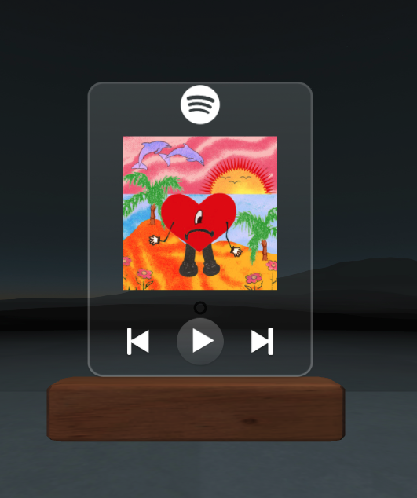
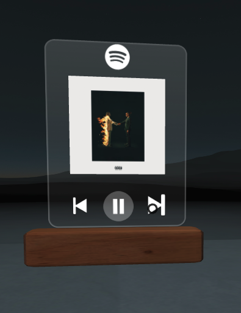

# Description

This is a web application that allows you to connect your spotify account and play music in web vr through a custom made UI. This project was made using React.jS, Aframe, Spotify SDK, and Spotify API.

## Screenshots

## Available Scripts

In the project directory, you can run:

### `npm start`

Runs the app frontend in the development mode.\
Open [http://localhost:3000](http://localhost:3000) to view it in your browser.

The page will reload when you make changes.\
You may also see any lint errors in the console.

## `npm server`

Runs the app backend in the development mode.\
Open [http://localhost:8080](http://localhost:8080) to view it in your browser.

## `npm dev`

Runs the app frontend & backend in the development mode.\
Open [http://localhost:3000](http://localhost:3000) to view it in your browser.

### `npm run build`

Builds the app for production to the `build` folder.\
It correctly bundles React in production mode and optimizes the build for the best performance.

The build is minified and the filenames include the hashes.\
Your app is ready to be deployed!

See the section about [deployment](https://facebook.github.io/create-react-app/docs/deployment) for more information.